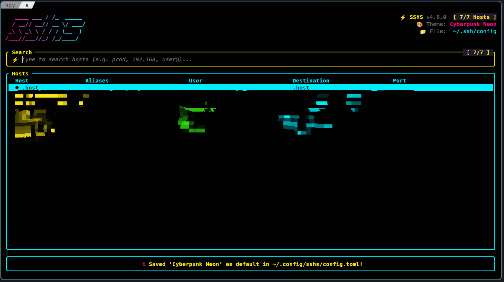

# sshs

<a href="https://repology.org/project/sshs/versions">
    
</a>

Terminal user interface for SSH with vibrant color themes, fancy ASCII art banners, and host inspection.  
It uses `~/.ssh/config` to list, search, inspect, and connect to hosts.

<br>



<br>


## Features

- 🎨 **Rich Modern Color Themes**: Catppuccin, Tokyo Night, Dracula, Nord, Gruvbox, Rosé Pine, One Dark, Kanagawa, Everforest, Solarized, Cyberpunk, Synthwave, Matrix, and all 22 Tailwind palettes.
- ✨ **Fancy ASCII Art Banners**: Stylish RGB gradient ASCII art headers (`slant`, `cyber`, `standard`, `mini`, `off`) with automatic responsive scaling.
- ⚙️ **Persistent Preferences**: Easily set your default theme via `~/.config/sshs/config.toml`, `SSHS_THEME` environment variable, or in-app <kbd>Ctrl+S</kbd>.
- 🖥 **Host Details Inspector**: Press <kbd>Tab</kbd> to inspect complete host details, identity files, proxy jump settings, and command preview.
- 🔍 **Instant Fuzzy Search**: Multi-token search filters across names, aliases, and destinations.
- ❓ **Interactive Help Modal**: Press <kbd>?</kbd> or <kbd>F1</kbd> for quick keybindings and shortcuts.

## Requirements

You need to have `ssh` installed and accessible from your terminal.

## How to install

### Homebrew

```shell
brew install sshs
```

### Chocolatey

Thanks to [Jakub Levý](https://github.com/jakublevy/chocopkgs/tree/master/sshs) for maintaining this package on Chocolatey.

```shell
choco install sshs
```

### Arch Linux / CachyOS

```shell
pacman -S sshs
```

### Alpine Linux

`sshs` is available in Alpine Linux [testing repository](https://pkgs.alpinelinux.org/package/edge/testing/x86_64/sshs).

```shell
apk add sshs
```

### Debian / Ubuntu

Download the `.deb` file for your architecture, then install it. Replace `amd64` with `arm64` on ARM machines.

```shell
curl -LO https://github.com/quantumsheep/sshs/releases/latest/download/sshs-linux-amd64.deb
sudo apt install ./sshs-linux-amd64.deb
```

### NetBSD

`sshs` is available on NetBSD from the [official repository](https://pkgsrc.se/security/sshs).

```shell
pkgin install sshs
```

### NixOS / Nix

#### As a Flake

```shell
nix profile install 'github:quantumsheep/sshs'
```

#### In your NixOS configuration

```nix
environment.systemPackages = with pkgs; [ sshs ];
```

#### In your Home Manager configuration

```nix
home.packages = with pkgs; [ sshs ];
```

### From releases

Releases contains prebuilt binaries for Linux, macOS and Windows. You can download them at <https://github.com/quantumsheep/sshs/releases>.

### From sources

Building sshs from sources requires [Rust](https://www.rust-lang.org/) compiler and [Cargo](https://doc.rust-lang.org/cargo/) to be installed. You can install them with [rustup](https://rustup.rs).

```bash
cargo install --git https://github.com/quantumsheep/sshs
```

Be sure to have `~/.cargo/bin` in your `PATH` environment variable.

You can also clone the repository and build it manually:

```bash
git clone https://github.com/quantumsheep/sshs.git
cd sshs
cargo build --release
```

The binary will be located at `./target/release/sshs` once the build is complete.

## Configuration & Customization

### 🎨 Themes & Colors

`sshs` includes **51 modern curated color themes** as well as support for all 22 Tailwind color palettes.

You can select a theme on startup using `--theme` (or `--color`):

```shell
# Curated Themes:
#   Catppuccin:  catppuccin (mocha), catppuccin-macchiato, catppuccin-frappe, catppuccin-latte
#   Tokyo Night: tokyonight, tokyonight-storm, tokyonight-light
#   Rosé Pine:   rose-pine, rose-pine-moon, rose-pine-dawn
#   GitHub:      github-dark, github-light
#   Solarized:   solarized-dark, solarized-light
#   Gruvbox:     gruvbox, gruvbox-light
#   Flexoki:     flexoki-dark, flexoki-light
#   Material:    material-ocean, material-darker
#   Classics:    dracula, dracula-soft, nord, onedark, kanagawa, everforest, ayu-dark
#   Editor Icons:monokai, doom-one, zenburn, base16, poimandres, vesper, night-owl, cobalt2, palenight
#   Vibrant/Sci-Fi: cyberpunk, synthwave, laserwave, shades-of-purple, aura, moonlight, oxocarbon,
#                matrix, hacker-amber, sunset, ocean, crimson, lavender, aquarium
sshs --theme catppuccin
sshs --theme tokyonight
sshs --theme dracula
sshs --theme github-dark
sshs --theme rose-pine
sshs --theme cyberpunk
sshs --theme matrix

# Or Tailwind Color Palettes (blue, emerald, rose, violet, amber, cyan, etc.):
sshs --color emerald
```

> **Tip:** You can dynamically cycle through themes inside the app anytime by pressing <kbd>Ctrl+T</kbd> or <kbd>F2</kbd>, and press <kbd>Ctrl+S</kbd> to save it as your default!

### ⚙️ Setting Your Default Theme & Preferences

You can set your default theme and preferences in three convenient ways:

#### 1. Configuration File (`~/.config/sshs/config.toml`)
Create or edit `~/.config/sshs/config.toml`:

```toml
theme = "tokyonight"          # Default theme
ascii_art = "cyber"           # Default banner: slant, cyber, standard, mini, off
# sort = true
# show_proxy_command = false
```

#### 2. In-App Keybinding (<kbd>Ctrl+S</kbd>)
Press <kbd>Ctrl+T</kbd> / <kbd>F2</kbd> to cycle to any theme you like, then press **<kbd>Ctrl+S</kbd>** to automatically save it as your default in `~/.config/sshs/config.toml`.

#### 3. Environment Variable (`SSHS_THEME`)
Set `SSHS_THEME` in your shell configuration (`~/.bashrc`, `~/.zshrc`, or `~/.config/fish/config.fish`):

```shell
export SSHS_THEME="tokyonight"
export SSHS_ASCII_ART="cyber"
```

### ✨ Fancy ASCII Art Banners & Animations

Add stylish ASCII art headers with smooth animated RGB gradients:

```shell
# Available styles: slant (default), cyber, standard, mini, off
sshs --ascii-art slant
sshs --ascii-art cyber
sshs --ascii-art standard
sshs --ascii-art mini

# Disable ASCII art banner for minimal view
sshs --no-ascii-art

# Disable animations (or toggle live with Ctrl+A)
sshs --no-animate
```

### 🚇 Advanced SSH Networking, Tunneling & Security Hub

`sshs` features a built-in interactive **Networking & Tunneling Hub** (<kbd>Ctrl+L</kbd> / <kbd>Ctrl+P</kbd> or <kbd>t</kbd> in Inspector):

- **Local Port Forwarding (`-L`)**: Forward local ports to remote network services (e.g. `8080:localhost:80` or `5432:db.internal:5432`).
- **Remote Port Forwarding (`-R`)**: Expose local development servers to the remote host (e.g. `9000:localhost:3000`).
- **Dynamic SOCKS5 Proxy (`-D`)**: Turn any remote SSH server into an encrypted SOCKS5 proxy (e.g. `1080`).
- **TUN / TAP VPN Tunneling (`-w`)**: Establish Layer 3 TUN or Layer 2 TAP virtual network interfaces (`any:any`) for full IP packet routing.
- **SSH over TOR (Onion Routing)**: Route SSH traffic directly through the Tor network (`127.0.0.1:9050`) or `.onion` hidden services.
- **Port Knocking Sequence**: Send native TCP port knocking sequences (e.g. `7000, 8000, 9000`) before connecting to open protected firewalls.
- **X11 GUI Forwarding (`-X` / `-Y`)**: Run remote graphical X11 Linux applications directly on your local display with compression support (<kbd>Ctrl+X</kbd> or <kbd>x</kbd> in Inspector).
- **Post-Quantum Cryptography (PQC) Mode**: Enforce quantum-resistant key exchanges (`mlkem768x25519-sha512@openssh.com`, `sntrup761x25519-sha512@openssh.com`) for ultra-secure connections.
- **On-Demand Key Copier (`ssh-copy-id`)**: Press <kbd>k</kbd> in the Host Details Inspector to install your public key for passwordless login on demand.

### 📂 SSHS Explorer (Dual-Pane SFTP / File Commander)

`sshs` includes a built-in interactive **SSHS Explorer** (<kbd>Ctrl+F</kbd> or <kbd>s</kbd> in Inspector):

- **Dual-Pane View**: Local filesystem on the left pane and remote SSH/SFTP filesystem on the right pane.
- **⚡ High-Speed Streaming `rsync` & `scp -O` Engine**:
  - High-speed directory and file uploads/downloads powered by native streaming `rsync` with live byte counters.
  - Automatic fallback to legacy original SCP protocol (`scp -r -O`) ensuring 100% transfer compatibility across minimal remote environments (Raspberry Pi, DietPi, OpenWrt, FreeBSD, Dropbear).
- **📊 Real-Time Transfer Progress Modal**:
  - Live percentage gauge `[████████████░░░░] 64%`, byte counter (`32.4 MB / 50.6 MB`), transfer speed gauge (`14.8 MB/s`), elapsed timer, and animated spinner.
  - Non-blocking asynchronous background execution so transfers run smoothly without freezing the UI.
- **🖱️ Full Mouse & Right-Click Context Menu**:
  - Right-click any file/folder (or press <kbd>m</kbd>) to open the interactive **Context Menu** popup with one-click actions:
    1. `[1]` 👁 View File Preview (<kbd>F3</kbd> / <kbd>v</kbd>)
    2. `[2]` 📤/📥 Transfer / Copy File & Folder (<kbd>F5</kbd> / <kbd>c</kbd>)
    3. `[3]` 📁 Create New Directory (<kbd>F7</kbd> / <kbd>m</kbd>)
    4. `[4]` 🗑 Delete File / Directory (<kbd>F8</kbd> / <kbd>d</kbd>)
    5. `[5]` 🚀 Open in Dolphin / External (<kbd>F9</kbd> / <kbd>o</kbd>)
    6. `[6]` 🔄 Refresh Directory Listing (<kbd>r</kbd>)
    7. `[7]` ❌ Close Context Menu (<kbd>Esc</kbd>)
- **Tabbed Pane Switching (<kbd>Tab</kbd>)**: Seamlessly toggle between local and remote file browsing.
- **Fast File Preview (<kbd>F3</kbd> / <kbd>v</kbd>)**: View local or remote file contents in a rich TUI viewer popup.
- **Directory Creation (<kbd>F7</kbd>)**: Create new folders remotely or locally with a quick modal.
- **File Deletion (<kbd>F8</kbd> / <kbd>d</kbd> / <kbd>Delete</kbd>)**: Delete selected local or remote files/directories.
- **External Integration (<kbd>F9</kbd> / <kbd>o</kbd>)**: Open current host directly in GUI file managers (e.g. Dolphin `sftp://...` on KDE) or Midnight Commander.

### 🖱️ Full Mouse & Touchpad Support

`sshs` features comprehensive **Mouse & Touchpad controls**:

- **Left Click**:
  - **Host Table**: Click any row to select it; click again or double-click to connect immediately via SSH.
  - **Footer Buttons**: Click any interactive bottom toolbar button (`Connect`, `Details`, `SFTP`, `X11`, `Tunnel`, `Add`, `Del`, `Theme`, `Help`, `Quit`).
  - **SSHS Explorer**: Click on Left or Right panes to switch focus and select files; double-click a folder to enter it; click any Context Menu item.
  - **Modals**: Click modal action buttons (`[ Connect ]`, `[ Cancel ]`, `[ Delete ]`, `[ Mode 1-8 ]`).
- **Right Click**:
  - **Host Table**: Right-click any host to open its **Host Details Inspector** modal instantly.
  - **SSHS Explorer**: Right-click any file/folder to open the interactive **Context Menu** popup.
  - **Modals**: Right-click anywhere in an open modal to dismiss/close it.
- **Mouse Wheel / Scroll**:
  - Scroll wheel up/down anywhere to navigate through hosts, dual-pane SSHS Explorer listings, and help menus.

### ⌨️ Keyboard Shortcuts & Controls

| Key | Action |
| --- | --- |
| <kbd>↑</kbd> / <kbd>↓</kbd>, <kbd>k</kbd> / <kbd>j</kbd> | Move selection up / down |
| <kbd>PageUp</kbd> / <kbd>PageDown</kbd> | Scroll one page up / down |
| <kbd>Home</kbd> / <kbd>End</kbd> | Jump to top / bottom |
| <kbd>Enter</kbd> | Connect to selected SSH host |
| <kbd>Ctrl+F</kbd> | Open SSHS Explorer (Dual-Pane SFTP File Commander) |
| <kbd>Ctrl+X</kbd> | Launch X11 GUI forwarding session (`ssh -Y -C`) |
| <kbd>Ctrl+L</kbd> / <kbd>Ctrl+P</kbd> | Open SSH Tunneling, TOR, PQC, Port Knocking & X11 Hub |
| <kbd>Tab</kbd> | Open Host Details Inspector modal (press <kbd>k</kbd> to install SSH key) |
| <kbd>Ctrl+N</kbd> | Add new SSH host to `~/.ssh/config` modal |
| <kbd>Ctrl+D</kbd> / <kbd>Delete</kbd> | Delete selected SSH host profile from `~/.ssh/config` |
| <kbd>Ctrl+T</kbd> / <kbd>F2</kbd> | Cycle visual theme |
| <kbd>Ctrl+S</kbd> | Save current theme to `~/.config/sshs/config.toml` |
| <kbd>Ctrl+A</kbd> | Toggle visual animations on / off |
| <kbd>Ctrl+R</kbd> | Reload SSH configuration files |
| <kbd>Ctrl+U</kbd> | Clear search query |
| <kbd>Ctrl+?</kbd> / <kbd>Ctrl+H</kbd> / <kbd>F1</kbd> | Open Help modal |
| <kbd>Esc</kbd> | Clear search or quit |

## Troubleshooting

### [...]/.ssh/config: no such file or directory

- Check if you have `~/.ssh/config` file
- If you don't, you can create it with `touch ~/.ssh/config`

If you want to use another SSH config file, you can use the `--config` option.

Here's a sample `~/.ssh/config` file:

```nginx
Host *
  AddKeysToAgent yes
  UseKeychain yes
  IdentityFile ~/.ssh/id_rsa

Host "My server"
  HostName server1.example.com
  User root
  Port 22

Host "Go through Proxy"
  HostName server2.example.com
  User someone
  Port 22
  ProxyCommand ssh -W %h:%p proxy.example.com
```

You can check the [OpenBSD `ssh_config` reference](https://man.openbsd.org/ssh_config.5) for more information on how to setup `~/.ssh/config`.
